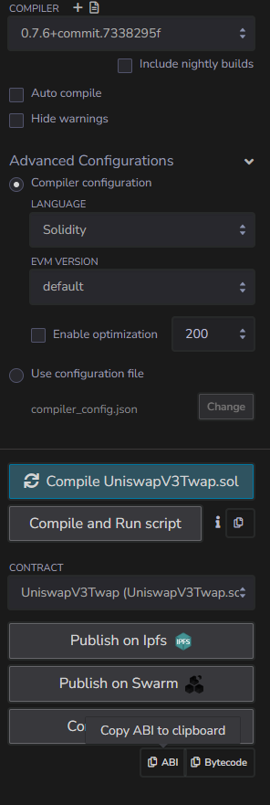

### Installing packages
1. ```npm init```, press enter for all prompts
2. ```npm install --save-dev hardhat```
3. ```npm install dotenv --save```
4. ```npm install --save-dev @nomiclabs/hardhat-ethers "ethers@^5.0.0"```
### Setting up Alchemy
1. Create an account: [Alchemy](https://www.alchemy.com/)
2. Go to apps and create a new app and select Ethereum Sepolia as the network
3. Navigate to the ```.env``` file and enter the api url for the Alchemy app
### Deploying Contract 
1. Get the private key of your Metamask wallet and enter into the ```.env``` 
   file
2. ```npx hardhat compile```
3. ```npx hardhat run deployments/deploy.js --network sepolia```
4. Copy the deployed contract address and copy into the ```.env``` file
### Automate with Chainlink
1. Follow steps to connect Metamask account to Chainlink
2. Select time based trigger and enter contract address
3. Copy and paste the ABI of the contract; it can be found in 
   ```artifacts/contracts/UniswapV3Twap.sol/UniswapV3Twap.json```. It can 
   also be copied from the Remix IDE in from the compiler tab.
4. Select a time schedule *(recommended 1 hour for sepolia testnet pool, but 
   can be less for active mainnet pools)*
5. Name, deposit funds, and register upkeep
### Retrieve blockchain data
1. ```npx hardhat run deployments/getOracle.js --network sepolia```
